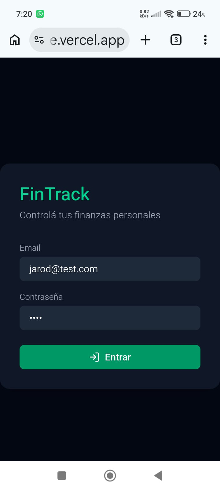
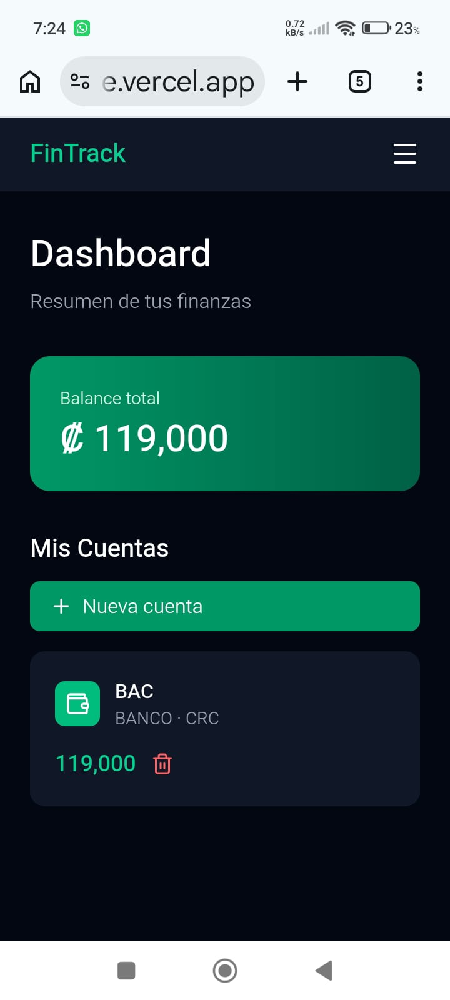
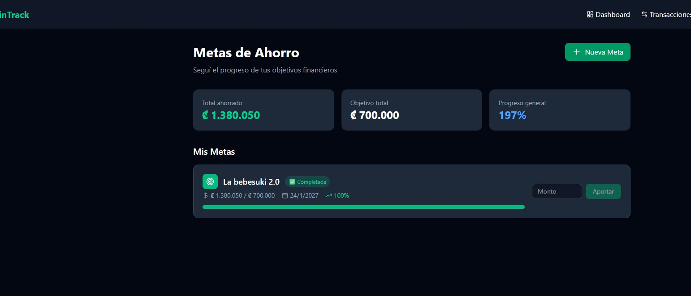

<div align="center">
  

  # FinTrack v2

  **Personal finance manager — web and Android**

  [](https://fintrack-v2-lake.vercel.app)
  [](https://render.com)
  [](LICENSE)

</div>

---

> 🇪🇸 [Versión en español](README.es.md)

---

## 📌 About

FinTrack v2 is a full-stack personal finance web application that lets users track income and expenses, manage savings goals, control budgets by account and currency, and monitor their overall financial balance — all in real time.

The app is deployed to production and also packaged as an Android APK via Capacitor.

---

## 📸 Screenshots

<div align="center">

| Login | Dashboard | Savings Goals |
|-------|-----------|---------------|
|  |  |  |

</div>

---

## 🚀 Features

- 🔐 Stateless authentication with JWT + Spring Security
- 💰 Income and expense tracking by account and currency
- 🎯 Savings goals with progress tracking
- 📊 Budget management per account
- 🔄 Automatic account balance updates on every transaction
- 📱 Android APK packaged with Capacitor
- ☁️ Deployed to production (Render + Vercel)
- ⚙️ Automated CI/CD with GitHub Actions

---

## 🛠️ Tech Stack

### Backend
| Technology | Purpose |
|---|---|
| Java + Spring Boot 4.1 | REST API |
| Spring Security + JWT | Authentication & authorization |
| PostgreSQL | Relational database |
| JPA / Hibernate | ORM |
| Docker | Containerization |

### Frontend
| Technology | Purpose |
|---|---|
| React + Vite | SPA framework |
| Tailwind CSS | Styling |
| Axios | HTTP client |
| Capacitor | Android APK packaging |

### DevOps
| Technology | Purpose |
|---|---|
| GitHub Actions | CI/CD pipeline |
| Render | Backend hosting |
| Vercel | Frontend hosting |

---

## 📁 Project Structure

```
fintrack-v2/
├── Backend/          # Spring Boot REST API
│   └── src/
├── frontend/         # React + Vite SPA
│   └── src/
└── docker-compose.yml
```

---

## ⚙️ Local Setup

### Prerequisites
- Java 21+
- Node.js 18+
- PostgreSQL
- Docker (optional)

### Backend

```bash
cd Backend
# Configure your .env or application.properties with DB credentials
./mvnw spring-boot:run
```

### Frontend

```bash
cd frontend
npm install
npm run dev
```

### With Docker

```bash
docker-compose up --build
```

---

## 🌐 Deployment

| Service | URL |
|---|---|
| Frontend (Vercel) | https://fintrack-v2-lake.vercel.app |
| Backend (Render) | Render free tier — cold starts may apply on first request |

> **Note:** The backend is hosted on Render's free plan. If the first request takes a few seconds, that's the server spinning up from idle.

### 🔑 Test account

| Field | Value |
|---|---|
| Email | prueba@fintrack.com |
| Password | fintrack123 |

> The server may take up to a minute to wake up on first load (free hosting).

---

## 👨‍💻 Author

**Jarod Bonilla Granados**
Systems Engineering Student — Universidad Nacional de Costa Rica (UNA)

[](https://linkedin.com/in/jarod-bonilla-granados-70b94b254)
[](https://github.com/JarodBonillaG)
